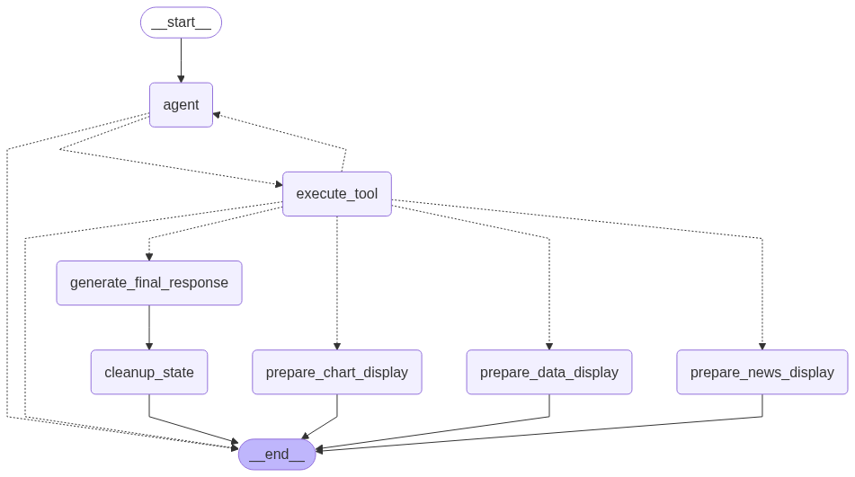

Projet OPA - Agent Analyste financier
==============================

Ce repo est un projet de fin d'étude réalisé dans le cadre du cursus Data Scientist chez DataScientest et l'Ecole des Mines Paris par Jerry PETILAIRE, Gilles LENY, Samuel LEE KWET SUN et Mathis GENTHON

Organisation du projet
------------

    ├── LICENSE
    ├── README.md                    <- Le README décrivant le projet
    ├── environment.yml              <- Le fichier yml permettant de copier l'environnement conda nécessaire à l'exécution du projet.
    │
    ├── notebooks                    <- Tous les notebooks et données utilsés pendant la phase de recherche
    │   ├── csv                      <- Les données utilisées pendant le projet.
    │   ├── Gilles                   <- Le travail de recherche effectué par Gilles LENY
    │   ├── Jerry                    <- Le travail de recherche effectué par Jerry PETILAIRE
    │   ├── Samuel                   <- Le travail de recherche effectué par Samuel LEE KWET SUN
    │   └── Mathis                   <- Le travail de recherche effectué par Mathis GENTHON, convention 'OPA#X' pour l'ordre de recherche
    │
    ├── models                       <- Les modèles finaux entraînés
    │
    ├── reports                      <- Les rapports produits pour la présentation du projet
    │   └── figures                  <- Les graphiques générés lors de la phase d'exploration des données
    │
    ├── agent                        <- Le code source de l'agent analyste 
    │   ├── app.py                   <- Le fichier streamlit utilisé pour lancer l'agent via 'streamlit run agent/app.py'
    │   ├── agent.py                 <- La logique agentique dévéloppée dans le framework LangGraph
    │   ├── tools.py                 <- La fichier référençant les outils disponibles pour l'agent 
    │   ├── agent_workflow.png       <- Visualisation des noeuds et relations du LangGraph de l'agent
    │   │
    │   ├── src                      <- Le dossier contenant les scripts des outils
    │   └── assets                   <- Le dossier contenant les assets nécessaires à l'UI de l'application Streamlit
    
--------

Liste des outils et capacités de l'agent
------------
1. `search_ticker`: Recherche le ticker boursier d'une entreprise à partir de son nom.
2. `fetch_data`: Récupère les données financières fondamentales pour un ticker boursier donné.
3. `preprocess_data`: Prépare les données financières récupérées pour la prédiction.
4. `predict_performance`: Prédit la performance d'une action en se basant sur les données prétraitées.
5. `display_raw_data`: Affiche le tableau de données financières brutes qui ont été initialement récupérées.
6. `display_processed_data`: Affiche le tableau de données financières traitées et nettoyées, prêtes pour l'analyse.
7. `create_dynamic_chart`: Crée un graphique interactif basé sur les données financières prétraitées.
8. `get_stock_news`: Récupère les dernières actualités pour un ticker donné.
9. `get_company_profile`: Récupère le profil d'une entreprise, incluant des informations clés comme le nom, le secteur, l'industrie, le CEO, etc.

Workflow de l'agent
------------

  

Mise en place de l'envrionnement 
------------
  
**Installer Miniconda**
  
https://www.anaconda.com/docs/getting-started/miniconda/install

**Vérfier l'installation**
  
```conda --version```

**Pour créer l'environnement de l'agent contenant les dépendances**
  
```conda env create -f environment.yml -n agent```
  

Obtention des clefs API
------------
  
Il est nécessaire d'obtenir deux clef API pour faire fonctionner l'agent
  
**Obtenir une clef API OpenRouter**
OpenRouter est le fournisseur de LLM utilisé :  
https://openrouter.ai/settings/keys
  
**Obtenir une clef API Financial Modeling Prep**
Financial Modeling Prep est le fournisseur de données financières :  
https://site.financialmodelingprep.com/developer/docs/dashboard

**Obtenir une clef API sur NewsAPI.org**
NewsAPI fournit les news liés aux entreprises : 
https://newsapi.org
  

Ajout des variables d'envrionnement 
------------
### Sur Windows
Lancer ces 3 lignes de commande
  
```[System.Environment]::SetEnvironmentVariable("OPENROUTER_API_KEY", "ma_clef_api_openrouter", "nom_de_l'utilisateur")```
  
```[System.Environment]::SetEnvironmentVariable("FMP_API_KEY", "ma_clef_api_fmp", "nom_de_l'utilisateur")```
  
```[System.Environment]::SetEnvironmentVariable("NEWS_API_KEY", "ma_clef_api_fmp", "nom_de_l'utilisateur")```

### Sur Linux / anciens macOS

```nano ~/.bashrc```
  
Ajouter ces trois lignes dans le fichier
   
```export OPENROUTER_API_KEY="ma_clef_api_openrouter"```
  
```export FMP_API_KEY="ma_clef_api_fmp"```
  
```export NEWS_API_KEY="ma_clef_newsapi"```

### Sur macOS (récent)
  
```nano ~/.zshrc```
  
Ajouter ces trois lignes dans le fichier
  
```export OPENROUTER_API_KEY="ma_clef_api_openrouter"```
  
```export FMP_API_KEY="ma_clef_api_fmp"```
  
```export NEWS_API_KEY="ma_clef_newsapi"```

Lancement de l'agent
------------
  
**Activer l'envrionnement pour la session en cours**
  
```conda activate agent```

**Lancer l'application Streamlit**
  
```streamlit run agent/app.y```


